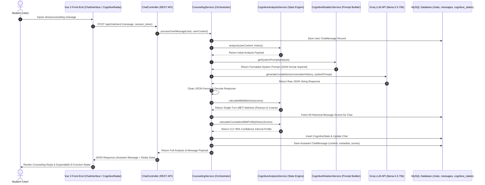
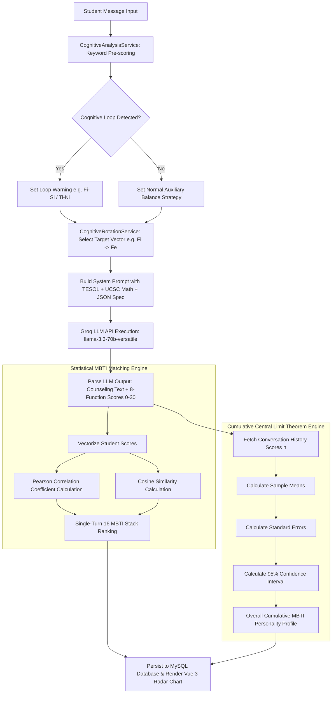

# Now: AI Counseling Platform for High-Stressed Students
> **Phase 1: A Jungian Cognitive Approach to Emotional Support**  
> **Slogan**: *"The secret to happiness is simple: when you have an apple, just think of this apple."*  
> **University**: IU International University  
> **Course**: DLBCSPJWD01  
> **Tutor**: Christian Remfert  
> **Student**: Yi-Ting (Edan) Huang  
> **Matriculation Number**: 92014459  

---

## 📖 Project Background & Core Philosophy

Modern technology is evolving at an exponential pace, and with it, so is the pressure we place on ourselves. We now live in a world more fast-paced than any generation before us. Students, particularly those in Asia, carry an enormous emotional burden when preparing for exams—a kind of accumulated emotional debt that rarely gets acknowledged, let alone addressed.

Drawing from my own experience and years of expertise building full-stack EdTech applications, I created **Now** (現在) to genuinely help. This project represents both an academic course submission for **IU International University** and an open, public exploration of human-centric EdTech. 


### Target Audience & Core Benefits
- **Target Audience**: Students experiencing high stress during the exam preparation phase.
- **Core Benefits**: At the heart of this project is a simple belief: *a calm mind is the foundation of everything, in exams and in life.* After using Now, students walk away feeling heard in a way they may never have experienced before. This does not happen through generic advice or automated responses, but through an attentive system that clears mental fog and provides emotional readiness.

### What Makes Now Different
My approach goes beyond simply plugging in an OpenAI API and calling it a day. I draw upon my professional background as a certified **TESOL/TEFL educator** and my specialized training in **"Teaching Math for Understanding"** from **UCSC** to bridge the gap between technical architecture and genuine pedagogical support.

Instead of generic responses, I am building a series of service layers that act as emotional filters. These layers draw on **Jung's cognitive theory** to help the system recognize not just what a user is saying but how they might be feeling. By combining teaching expertise with psychological frameworks, the system responds in a way that truly meets students where they are, providing guidance that is both intellectually structured and emotionally resonant.

---

## 🧠 Psychological Framework: Jungian Cognitive Function Matrix

Now evaluates user inputs against Carl Jung's 8 Cognitive Functions ($Ne, Ni, Se, Si, Te, Ti, Fe, Fi$). 

### Standard 16 MBTI 8-Cognitive Function Matrix
The system incorporates the standard relative weight matrix (scaled 1–5 per function) to map personality stacks:

| MBTI Type | Ne | Ni | Se | Si | Te | Ti | Fe | Fi |
| :--- | :---: | :---: | :---: | :---: | :---: | :---: | :---: | :---: |
| **INTJ** | 1 | 5 | 1 | 2 | 4 | 3 | 1 | 3 |
| **INTP** | 4 | 3 | 1 | 1 | 2 | 5 | 1 | 2 |
| **ENTJ** | 2 | 4 | 3 | 1 | 5 | 2 | 3 | 1 |
| **ENTP** | 5 | 2 | 2 | 1 | 3 | 4 | 2 | 1 |
| **INFJ** | 3 | 5 | 1 | 2 | 1 | 3 | 4 | 2 |
| **INFP** | 4 | 3 | 1 | 1 | 1 | 2 | 3 | 5 |
| **ENFJ** | 3 | 4 | 2 | 1 | 2 | 1 | 5 | 3 |
| **ENFP** | 5 | 2 | 3 | 1 | 1 | 2 | 4 | 3 |
| **ISTJ** | 1 | 2 | 3 | 5 | 4 | 1 | 1 | 3 |
| **ISFJ** | 1 | 2 | 2 | 5 | 1 | 3 | 4 | 3 |
| **ESTJ** | 2 | 1 | 4 | 3 | 5 | 1 | 3 | 1 |
| **ESFJ** | 2 | 1 | 3 | 4 | 3 | 1 | 5 | 2 |
| **ISTP** | 2 | 1 | 4 | 3 | 1 | 5 | 2 | 1 |
| **ISFP** | 2 | 1 | 5 | 3 | 1 | 2 | 1 | 4 |
| **ESTP** | 3 | 1 | 5 | 2 | 4 | 3 | 2 | 1 |
| **ESFP** | 3 | 1 | 5 | 2 | 2 | 1 | 4 | 3 |

#### Cognitive Loop Detection & Cognitive Rotation Intervention
Students under severe stress frequently experience **1-3 Cognitive Loops** (e.g., $Fi-Si$ loop ruminating on past failures, or $Ti-Ni$ loop over-analyzing catastrophic outcomes). 

Now's `CognitiveAnalysisService` detects these loops in real time and triggers `CognitiveRotationService` to generate targeted rotation vectors (e.g. $Fi \rightarrow Fe$ or $Ti \rightarrow Te$) to break cognitive paralysis.

---

## 📊 Advanced Statistical MBTI Engine

Now leverages the `markrogoyski/math-php` library to evaluate student cognitive profiles across two distinct statistical dimensions:

### A. Single-Turn MBTI Vector Matching
For each statement, the 8-function intensity vector $\mathbf{A} = [Ne, Ni, Se, Si, Te, Ti, Fe, Fi]$ is evaluated against the 16 standard MBTI personality matrices $\mathbf{B}_{type}$ using:
1. **Pearson Correlation Coefficient ($r$)**:
   Measures relative variance and pattern similarity across the cognitive stack.
2. **Cosine Similarity**:
   Measures vector direction and proportions, ensuring statement length does not skew personality classification.

### B. Cumulative Central Limit Theorem (CLT) 95% Confidence Interval Model
To determine a student's overall, long-term personality profile across an entire conversation session ($n$ statements):
1. **Sample Mean ($\bar{X}$)** for each of the 8 cognitive functions.
2. **Standard Error ($SE$)**:
   $$SE = \frac{S}{\sqrt{n}}$$
3. **95% Confidence Interval (CI)**:
   $$95\% \text{ CI} = \bar{X} \pm 1.96 \times SE$$
4. The resulting sample mean vector is matched against the 16 MBTI matrices to deliver a statistically rigorous overall personality profile.

---

## 📐 System Architecture & Data Flow Diagrams

### System Interaction Sequence Diagram


---

### Data Processing & Statistics Flowchart


---

## 🛠️ Tech Stack
- **Back-end Framework**: Laravel 10/11 (PHP 8.1+)
- **Statistical Processing**: `markrogoyski/math-php` (v2.13.0)
- **Front-end Architecture**: Vue 3 (Composition API) & Inertia.js
- **Styling**: Tailwind CSS (Pure White Design System)
- **Visualization**: Chart.js & `vue-chartjs` (Radar Charting)
- **Cognitive Engine**: Groq API (`llama-3.3-70b-versatile`)
- **Communication**: Axios (RESTful API)
- **Database**: MySQL

---

## 🚀 Installation & Setup

1. **Clone & Install PHP Dependencies**:
   ```bash
   composer install
   ```

2. **Install Frontend Dependencies**:
   ```bash
   npm install
   ```

3. **Configure Environment**:
   ```bash
   cp .env.example .env
   php artisan key:generate
   ```
   Add your Groq API key to `.env`:
   ```env
   GROQ_API_KEY=your_groq_api_key_here
   ```

4. **Run Database Migrations**:
   ```bash
   php artisan migrate
   ```

5. **Build Assets & Run Local Server**:
   ```bash
   npm run build
   php artisan serve
   ```
