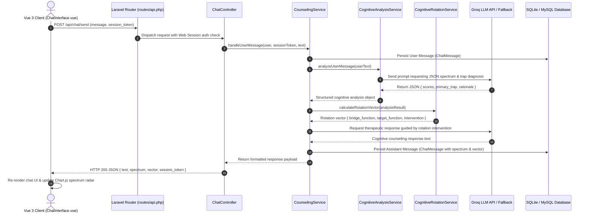

# NOW — Jungian Cognitive Rotation Counseling Platform

> **University Web Development Portfolio Project**  
> Developed for **IU International University** to demonstrate advanced full-stack web development capabilities using **Laravel 10**, **Vue 3 (Composition API)**, **Bootstrap 5**, and **LLM Cognitive Semantic Analysis**.

---

## Table of Contents
1. [Overview & Mission](#overview--mission)
2. [Developer Reflection & Scope Statement](#developer-reflection--scope-statement)
3. [Carl Jung 8-Cognitive Functions & Rotation Matrix](#carl-jung-8-cognitive-functions--rotation-matrix)
   - [The 8 Cognitive Functions](#1-the-8-cognitive-functions)
   - [The Cognitive Rotation Matrix](#2-theoretical-concept-the-cognitive-rotation-matrix)
   - [Advanced Theoretical Expansion & Future Roadmap](#3-advanced-theoretical-expansion--future-roadmap)
4. [System Architecture & Directory Structure](#system-architecture--directory-structure)
5. [Request Lifecycle & Execution Flow](#request-lifecycle--execution-flow)
6. [Step-by-Step Developer Setup Guide](#step-by-step-developer-setup-guide)
7. [Demo Credentials & Automated Testing](#demo-credentials--automated-testing)
8. [License](#license)

---

## Overview & Mission

**NOW** is an interactive, AI-powered psychological counseling platform built on **Carl Jung's 8-Cognitive Functions Theory** ($Ni, Ne, Si, Se, Ti, Te, Fi, Fe$) and the **Two-Stage Cognitive Rotation Engine**.

Cognitive paralysis and emotional distress often result from trapped thought loops: over-analyzing past failures ($Fi/Si$) or projecting catastrophic futures ($Ni/Ti$). **NOW** dynamically diagnoses the user's cognitive state during every conversation turn and calculates a vector transformation that rotates their focus into present-moment clarity (**"NOW"**).

---

## Developer Reflection & Scope Statement

### Full-Stack Architecture Focus
As an independent software developer accustomed to building end-to-end commercial web products (including payment gateway integrations, microservices, and full business logic engines), I designed **NOW** to demonstrate high-level full-stack engineering principles, clean SOLID code organization, and responsive UI design.

### Academic Scope vs. Production Features
Because this repository was crafted specifically as a university portfolio project for **IU International University**, production-only enterprise features (such as credit card processing, subscription webhooks, or multi-tenant billing) were intentionally left out. 

Similarly, from an architectural standpoint, while custom Laravel **Form Requests** (`app/Http/Requests/*`) and **API Resources** (`app/Http/Resources/*`) could be introduced, doing so for a focused chat counseling API would introduce unnecessary boilerplate and over-engineering. Instead, keeping input validation and data transformation clean and direct strikes the optimal balance between pragmatic design and SOLID discipline.

Instead, engineering efforts were focused on solving a more sophisticated technical challenge:
1. Building a deterministic **2-Stage Cognitive Rotation Engine** powered by semantic LLM JSON analysis.
2. Constructing an app-like, full-screen responsive client using **Vue 3 (Composition API)** and **Bootstrap 5**.
3. Establishing a 100% verified automated test suite (**21 PHPUnit unit and feature tests**) ensuring memory safety, guest quota security, and payload validation.

---

## Carl Jung 8-Cognitive Functions & Rotation Matrix

### 1. The 8 Cognitive Functions
Jungian typography categorizes mental processing into 8 core orientations across 4 dimensions:

| Function | Name | Orientation | Core Mental Activity |
| :--- | :--- | :--- | :--- |
| **Fi** | Introverted Feeling | Internal Value | Authentic personal values, identity, & moral alignment |
| **Fe** | Extraverted Feeling | Interpersonal | Social empathy, collective values, & harmony |
| **Ti** | Introverted Thinking | Analytical | Internal logical frameworks, precise definition |
| **Te** | Extraverted Thinking | Operational | External structure, execution, & objective results |
| **Ni** | Introverted Intuition | Strategic Vision | Singular long-term vision & deep pattern synthesis |
| **Ne** | Extraverted Intuition | Creative Potential | Exploring open possibilities & creative pathways |
| **Si** | Introverted Sensing | Experiential Memory| Anchoring past experience, routine, & detail retention |
| **Se** | Extraverted Sensing | Present Reality | Physical sensory awareness & active engagement in "NOW" |

---

### 2. Theoretical Concept: The Cognitive Rotation Matrix

The counseling engine models user mental states as dynamic points in an 8-dimensional cognitive space:

$$\mathbf{S} = [Fi, Fe, Ti, Te, Ni, Ne, Si, Se]^T \quad \text{where } \sum_{i=1}^{8} S_i = 1.0$$

When a user is caught in a cognitive loop (e.g., severe self-blame $Fi$ or logic paralysis $Ti$), direct forcing into execution ($Te$) or sensory presence ($Se$) often causes internal resistance. To resolve this, **NOW** applies a **2-Stage Rotation Vector Transformation**:

$$\mathbf{S}_{\text{initial}} \xrightarrow{\text{Stage 1: Pivot}} \mathbf{S}_{\text{bridge}} \xrightarrow{\text{Stage 2: Grounding}} \mathbf{S}_{\text{NOW}}$$

#### Dynamic Rotation Transformation Paths

```
    [State Diagnosis]               [Stage 1: Pivot]               [Stage 2: Grounding]
(Trapped Cognitive Loop)  ───►  (Empathy / Option Bridge)  ───►  (Action / Presence in NOW)

    1. Fi Self-Blame      ───►    Fe (Active Empathy)     ───►    Te (Structured Action)
    2. Ti Over-Analysis   ───►    Ne (Open Possibilities) ───►    Se (Present Reality)
    3. Ni Future Anxiety  ───►    Fi (Core Affirmation)   ───►    Se (Sensory Reality)
    4. Si Past Failure    ───►    Fe (Social Support)     ───►    Ne (New Opportunities)
```

---

### 3. Advanced Theoretical Expansion & Future Roadmap

*Conceptual Note: The mathematical formulations, graph traversals, and statistical models outlined below represent high-level theoretical concepts and future research proposals. They have not been deeply evaluated for optimal mathematical implementation, nor are they fully implemented within this codebase, as the primary objective of this university project is to demonstrate core full-stack web development capabilities (Laravel, Vue 3, API integration, and automated testing).*

While the current engine successfully implements the 2-Stage Rotation Matrix, several high-order analytical expansions can be integrated into future iterations:

#### A. 1-3 Cognitive Loop Detection (Ego Imbalance)
In Jungian/MBTI psychology, healthy cognitive processing requires balancing introverted and extraverted orientations. In states of high stress or anxiety, individuals often drop into an **unconscious 1-3 Cognitive Loop**:
- **INFJ/INTJ ($Ni-Ti$ Loop)**: Over-analyzing hypothetical future catastrophes while skipping extraverted engagement ($Fe/Te$).
- **INFP/ISFP ($Fi-Si$ Loop)**: Rumination over past failure memories ($Si$) to justify personal emotional pain ($Fi$), bypassing extraverted possibilities ($Ne/Se$).
- **ENFP/ENTP ($Ne-Te$ Loop)**: Hyperactive brainstorming and hasty execution without internal value reflection ($Fi/Ti$).

*Future Enhancement*: Diagnosing non-adjacent function loops ($Function_1 \leftrightarrow Function_3$) and deploying the missing auxiliary function ($Function_2$) as the primary intervention pivot.

#### B. Graph Theory & Directed Cognitive Traversals
Cognitive state shifts can be modeled using a weighted directed graph $G = (V, E)$, where vertices $V$ represent the 8 cognitive functions and edges $E$ represent psychological transition paths with associated resistance weights $w(u, v)$:

$$\text{Cost}(Path) = \sum_{(u, v) \in Path} w(u, v)$$

By applying graph search algorithms (such as **Dijkstra's Shortest Path** or **Topological Traversal**), the system can compute the mathematically optimal multi-step intervention trajectory that minimizes cognitive friction for specific personality types.

#### C. Statistical Spectrum & Bayesian MBTI Estimation
Over multi-turn counseling sessions, a user's cumulative spectrum readings generate a continuous probability density distribution over cognitive dimensions. Using **Bayesian Statistical Inference**:

$$P(\text{MBTI Type} \mid M_1, M_2, \dots, M_n) \propto P(\text{MBTI Type}) \prod_{k=1}^{n} P(M_k \mid \text{MBTI Type})$$

The platform can progressively estimate the user's primary personality profile and dynamically customize long-term counseling strategies without requiring manual survey questionnaires.

---

## System Architecture & Directory Structure

The repository follows clean software design principles (SOLID), separating business logic into dedicated services and keeping controller layers lightweight.

```
IU-Web-Project/
├── app/
│   ├── Http/
│   │   ├── Controllers/
│   │   │   ├── ChatController.php         # Chat workspace & API routing logic
│   │   │   └── HomeController.php         # User dashboard & session listing
│   │   └── Middleware/                    # Auth & Web session middleware
│   ├── Models/
│   │   ├── User.php                       # User authentication model
│   │   ├── ChatMessage.php                # Individual message with cognitive scores
│   │   └── ChatSession.php                # Chat session metadata & session token
│   └── Services/
│       ├── CognitiveAnalysisService.php   # LLM semantic parser & JSON extraction
│       ├── CognitiveRotationService.php   # 2-Stage rotation matrix calculation
│       └── CounselingService.php          # Orchestrator for chat sessions & storage
├── config/                                # Application configurations (chat, auth, database)
├── database/
│   ├── migrations/                        # Database schema definition files
│   └── seeders/                           # DatabaseSeeder & demo user seeds
├── resources/
│   ├── js/
│   │   ├── app.js                         # Vue 3 application mount entry point
│   │   ├── bootstrap.js                   # Axios & environment setup
│   │   └── components/
│   │       ├── ChatInterface.vue          # Interactive RWD counseling workspace
│   │       └── CognitiveRadarChart.vue    # Per-message Chart.js 8-function radar
│   ├── sass/                              # SCSS styles & Bootstrap 5 customizations
│   └── views/
│       ├── counseling.blade.php           # Counseling main workspace view
│       ├── home.blade.php                 # User dashboard view
│       ├── layouts/app.blade.php          # Base HTML5 layout
│       └── welcome.blade.php              # Landing page view
├── routes/
│   ├── api.php                            # Chat API routes with web session middleware
│   └── web.php                            # Blade page routes (counseling, home, auth)
└── tests/
    ├── Feature/                           # Integration & API endpoint tests
    └── Unit/                              # Cognitive math & rotation engine tests
```

---

## Request Lifecycle & Execution Flow

Understanding how a user prompt moves through the application stack:



---

## Step-by-Step Developer Setup Guide

Follow this step-by-step guide to clone, configure, and run the platform from scratch on a new machine.

### 1. System Requirements
- **PHP**: `>= 8.2` (with `pdo`, `mbstring`, `openssl`, `tokenizer`, `xml` extensions)
- **Composer**: Dependency manager for PHP
- **Node.js**: `>= 18.x` and **npm**
- **Database**: MySQL / MariaDB (default database) or SQLite / PostgreSQL

---

### 2. Step 1: Clone the Repository
Open your terminal and clone the source code:

```bash
git clone https://github.com/Edan0615/IU_Web.git
cd IU-Web-Project
```

---

### 3. Step 2: Install Dependencies

Install backend PHP packages:
```bash
composer install
```

Install frontend JavaScript dependencies:
```bash
npm install
```

---

### 4. Step 3: Environment Setup

Duplicate the `.env.example` file to create your local `.env`:
```bash
cp .env.example .env
```

Generate the unique Laravel application encryption key:
```bash
php artisan key:generate
```

---

### 5. Step 4: Configure Database

#### Option A: MySQL / MariaDB (Primary Database)
Update your `.env` variables to match your MySQL database credentials:
```env
DB_CONNECTION=mysql
DB_HOST=127.0.0.1
DB_PORT=3306
DB_DATABASE=iu_web
DB_USERNAME=root
DB_PASSWORD=your_mysql_password
```

#### Option B: SQLite (Optional Zero-Config Setup)
1. Ensure your `.env` contains:
   ```env
   DB_CONNECTION=sqlite
   ```
2. Create the SQLite file if it doesn't exist:
   ```bash
   touch database/database.sqlite
   ```

---

### 6. Step 5: Run Database Migrations & Seeders

Execute database migrations to build tables (`users`, `chat_sessions`, `chat_messages`) and populate demo data:

```bash
php artisan migrate:fresh --seed
```

---

### 7. Step 6: Compile Assets & Launch Local Servers

#### Terminal 1: Compile Frontend Assets (Vite HMR)
```bash
npm run dev
```

#### Terminal 2: Start Laravel Local Development Server
```bash
php artisan serve
```

The application will now be live at **`http://127.0.0.1:8000`**.

---

## Demo Credentials & Automated Testing

### 1. Demo User Login
You can instantly log in to explore full session history and cognitive tracking:
- **URL**: `http://127.0.0.1:8000/login`
- **Email**: `tester@gmail.com`
- **Password**: `abc123456789`

---

### 2. Guest Free Trial
- Unauthenticated visitors can visit `http://127.0.0.1:8000/counseling` to test up to **3 free messages**.
- After 3 messages, server-side guest gate triggers an HTTP 403 prompt encouraging user registration.

---

### 3. Running Automated Tests

The application includes a comprehensive test suite of **21 unit and feature tests** (131 assertions):

```bash
php artisan test
```

#### Test Suite Highlights:
- **Unit Tests**: Cognitive matrix calculations, fallback spectrum generation, rotation vector mapping.
- **Feature Tests**: Guest message quota enforcement, multi-turn conversation session state, XSS script sanitization, maximum input payload bounds.

---

## License
This project is developed as an academic portfolio project for **IU International University**. All rights reserved.
